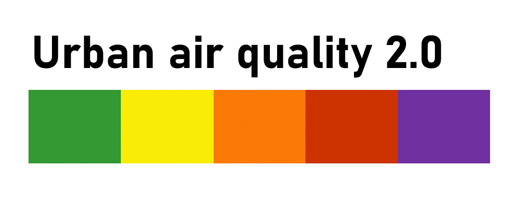

# CREDITS, LICENSE AND CITATIONS

**r5 routing engine**

[R5 open source code](https://github.com/conveyal/r5/#methodology) 

[Conway, M. W., Byrd, A., & van der Linden, M. (2017): Transportation Research Record: Journal of the Transportation Research Board, DOI:10.3141/2653-06](https://journals.sagepub.com/doi/10.3141/2653-06)

[Conway, M. W., Byrd, A., & Van Eggermond, M. (2018): Journal of Transport and Land Use, DOI:10.5198/jtlu.2018.1074](https://www.jtlu.org/index.php/jtlu/article/view/1074)

[Conway, M. W. & Stewart, A. F. (2019): International Journal of Geographical Information Science, DOI:10.1080/13658816.2019.1605075](https://www.tandfonline.com/doi/full/10.1080/13658816.2019.1605075)

**r5py**

[Open source r5py codes](https://github.com/r5py/r5py)

[Fink, C., Klumpenhouwer, W., Saraiva, M., Pereira, R., & Tenkanen, H. (2022): R5py: Rapid Realistic Routing with R5 in Python, DOI:10.5281/ZENODO.7060437](https://zenodo.org/records/7060438)

**Green Paths (1.0)**

[Helle J, Poom A, Willberg E, Toivonen T 2023 The Green Paths Route Planning Software for Exposure-Optimised Active Travel. Journal of Open Research Software, DOI: 10.5334/jors.400](https://www.researchgate.net/publication/374714949_The_Green_Paths_Route_Planning_Software_for_Exposure-Optimised_Active_Travel) 
[Open source Green Paths code](https://github.com/DigitalGeographyLab/green-paths)
[Online GUI](https://green-paths.web.app/?map=streets)
[Blog post](https://blogs.helsinki.fi/digital-geography/2020/07/14/quiet-paths-for-daily-travel-developing-online-navigation-and-exposure-assessment-tool/#more-464)
[Full thesis J.Helle](https://helda.helsinki.fi/items/abff1b7a-5f18-4113-9f41-f6dd53ff7612)

## Affiliations

[Digital Geography Lab](https://www.helsinki.fi/en/researchgroups/digital-geography-lab)

[Urban Air Quality 2.0 (UAQ2.0)](https://www.hsy.fi/en/hsy/hsys-projects/project-pages/urban-air-quality-2.0-project/)

[GREENTRAVEL project 2023-2027](https://www.helsinki.fi/en/researchgroups/digital-geography-lab/projects/greentravel)

  
  

## License

TODO add license and .md
