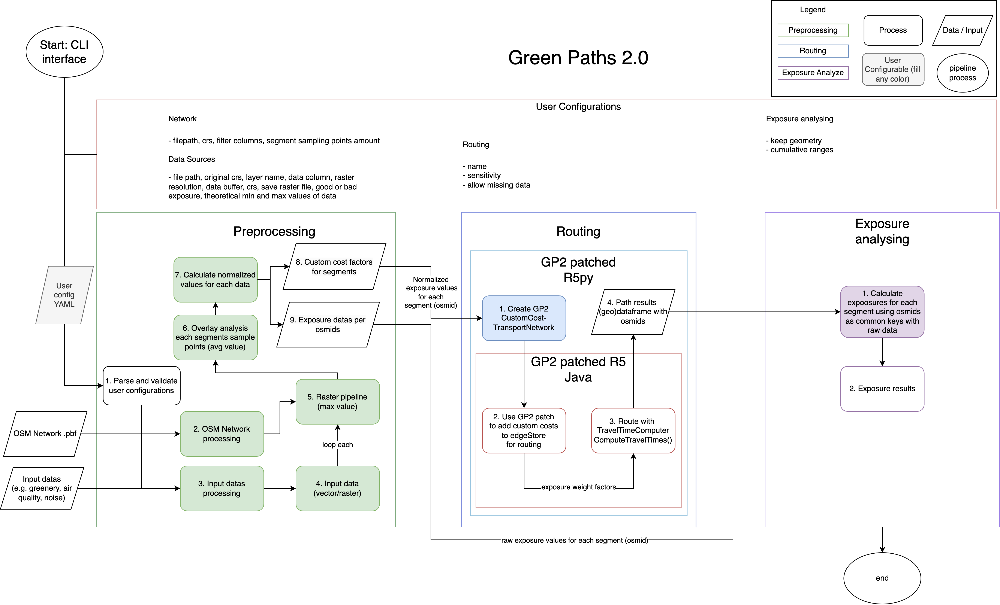
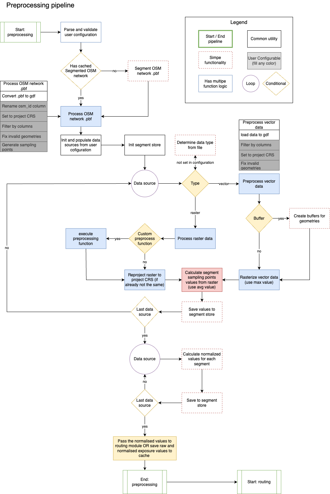
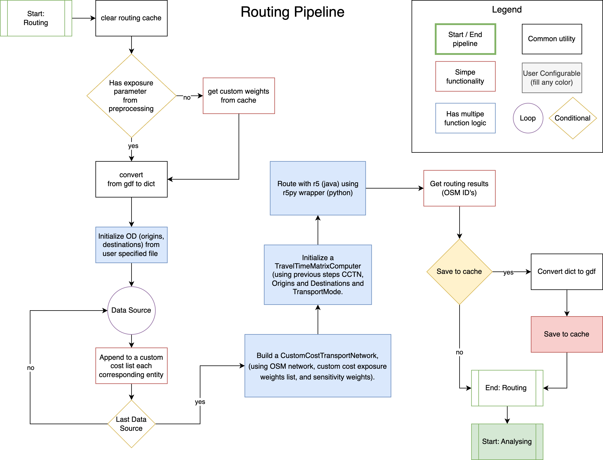
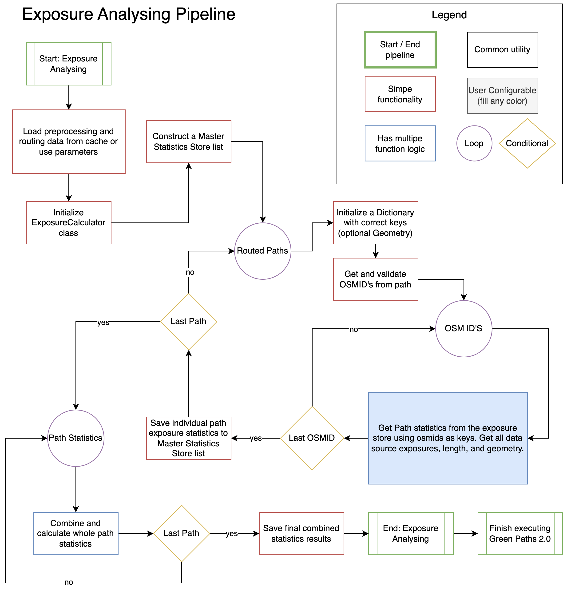

# Modules and Components

Green Paths 2.0 consists of three main modules and two routing dependencies. 

The three modules are

- Preprocessing: calculating exposure values from exposure data and attaching them to the OSM road segments.
- Routing: routing with expoure weighted road network.
- (Exposure) Analysis: calculating exposure analytics from the paths taken.

The two routing dependencies are

- r5: Java written route finding library.
- r5py: Python written wrapper interface for utilizing r5 with Python.

The following section will go through the main components briefly. For more detailed descriptions, refer to [ Master's Thesis by R. Heinonen](https://helda.helsinki.fi/items/5b77f6c3-2d2c-455f-bb8c-528b0ac136d8) (some parts refer to June 2024 version).

  
   
  <i>Green Paths 2.0 general flowchart. The modules / pipelines are not transfering OSM ID's etc. anymore, everything goes to and from sqlite3.</i>

## Post-thesis Improvements (after June 2024) to the software

There has been couple of main improvements after the completion of the thesis. 

- The cache is moved from directory based saving to use Sqlite3. All modules save their results to the local db.
- The routing module (and dependencies r5, r5py) support now the precalculations. This means that custom cost values for segments are by default calcutated before the actual routing to the segments.
This should make the routing process faster, especially for mass calculations of routes.

## Preprocessing

The preprocessing module is responsible for calculating raw and normalized exposure values for OSM segments, in order to weighten the A* costs for edges. The module accepts both raster and vector formats.

  
   
  <i>Preprocessing module flowchart. The "cache" is currenly sqlite3.</i>

### OSM Network
OSM network goes through a segmentation, which means that the native OSM ways are split from intersections. This is necessary as we are using OSM ID's as the common key in all of the modules.
Native OSM segments can expand over multiple intersections, possibly adding too long roads for some OSM ID's compared to the actual road taken during the route finding.
The segments are then given new negative OSM ID's which are used in context of Green Paths 2.0.

The OSM network is then converted to the Geopandas geodataframe. This might not be the fastest solution, but it adds support to various input filetypes.

### Rasterization pipeline
The rasterization pipeline is executed for vector data types. Based on user input the vector data is rasterized, by taking the maximum value found inside the raster cells, making the raster size important to consider.

Raster exposure data is used as is, unless raster cell size is defined in user configurations, then the raster is reprojected to the given resolution.

### Overlay analysis
The exposure raster for each exposure data source is overlayed with the OSM road network. Sampling points are created for each segment, their cost average is calculated, and saved as the segments' exposure costs for that particular exposure type.

### Normalization
All of the "raw" exposure values are then normalized based on user configurations theoretical min and max values for that data. The scale is between 0-1. This is done to be able to compare different exposure data.
This normalized exposure factor is passed to the routing module (with sensitivity weight) to update each segmnents traversal time costs.

## Routing
The routing module uses the normalized exposure costs and OSM ID's to create a custom cost mapping for the routing process, which is used to modify the segment traversal cost by using the time and exposure(s).
After the path is taken, it will see what all OSM ID's were traversed and save a list of OSM ID's per path to the Sqlite3 db. Also the actual travel time seconds are saved, before altering the traversal cost.

  
   
  <i>Routing module flowchart.</i>

## Analysing
The Analysing module calculates the exposure metrics for each path taken, by combining the OSM ID's returned from routing module and the values found from the exposure database table, using OSM ID as the common key.

  
   
  <i>Exposure analysing module flowchart. Logic of looping the paths has changed a little after improvements. </i>

